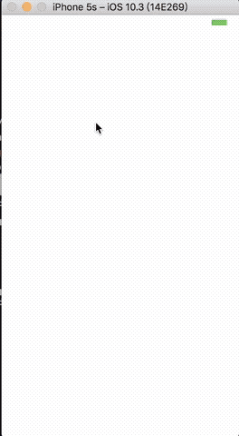

#  模仿Bilibili（Bilibili - ( ゜- ゜)つロ 乾杯~）
> 练习工程 模仿bilibili

##  接口

>使用 m.bilibili.com中使用的

###  首页接口

* 推荐页
    * 滚动推荐: http://api.bilibili.com/x/web-show/res/loc?jsonp=jsonp&pf=7&id=1695
        * 该链接在 m.bilibili.com/index.html 源代码254行产生。
    * 科技区/动画区等各个区的排行：http://m.bilibili.com/index/ding.html
        * 修改为 http://api.bilibili.com/x/web-interface/dynamic/index?jsonp=jsonp
* 直播页
    * 滚动推荐 以及各个区的内容 : http://api.live.bilibili.com/AppIndex/home?device=phone&platform=ios&scale=3&build=10000
* 番剧页
    * 推荐： http://www.bilibili.com/index/catalogy/13-recommend.json
    * 连载动画 ： http://www.bilibili.com/index/catalogy/33-week.json
    * 完结动画 ： http://www.bilibili.com/index/catalogy/32-week.json
    * 资讯 ：http://www.bilibili.com/index/catalogy/51-week.json
    * 官方延伸 ：http://www.bilibili.com/index/catalogy/152-week.json

### 播放

* 视频播放页 比如： http://m.bilibili.com/video/av11413190.html 
    * 视频：http://tx.acgvideo.com/9/55/18869362-1.mp4?txTime=1498036248&platform=html5&txSecret=118d82eb2e76a4a3d9f92e7e27d9deb8&oi=3078728740&rate=110000
        * 视频链接来自于：
            * http://api.bilibili.com/playurl?callback=callbackfunction&aid=11413190&page=1&platform=html5&quality=1&vtype=mp4&type=jsonp&token=4ad38e0fb723286165c5e492335a21d1
            * playurl链接由其他js脚本(http://s1.hdslb.com/bfs/static/mult/videoPage-1407103658.js)拼接而成，(其中token参数没有也没关系)那么知道aid就可以获得拼接后的链接了。
            * playurl链接需要cookies
    * 弹幕: http://comment.bilibili.com/18869362.xml
        * 18869362 为cid
        * cid 也由playurl请求中返回
* 视频相关信息
    * http://comment.bilibili.com/recommendnew,12743458
        *  12743458 为当前视频 aid
* 评论信息
    * http://api.bilibili.com/x/v2/reply?callback=jQuery17202468624533958459_1502094946409&jsonp=jsonp&type=1&sort=2&oid=12853735&pn=1&nohot=1&_=1502094946717
        * callback 和 最后的 “_” 不需要
        * oid 为视频的 aid

##  第三方

* [Alamofire](https://github.com/Alamofire/Alamofire) 网络请求
* [GDPerformanceView](https://github.com/dani-gavrilov/GDPerformanceView-Swift) 显示fps
* [SnapKit](https://github.com/SnapKit/SnapKit) autolayout
* [HandyJSON](https://github.com/alibaba/HandyJSON) json序列化
* [SDWebImage](https://github.com/rs/SDWebImage) image downloader with cache support
* [Refresher](https://github.com/jcavar/refresher) 一个可以简单自定义刷新视图的下拉刷新组件

* 弃用
    * [PageMenu](https://github.com/PageMenu/PageMenu) 分页（自定义麻烦）
    * [iOSPalette](https://github.com/tangdiforx/iOSPalette)获取图片主色调（有比较大几率获取到不正确的颜色）	

## 文件模板

### viewcontrollerrrr

>life cycle & property

>setup UI & add Constraints
